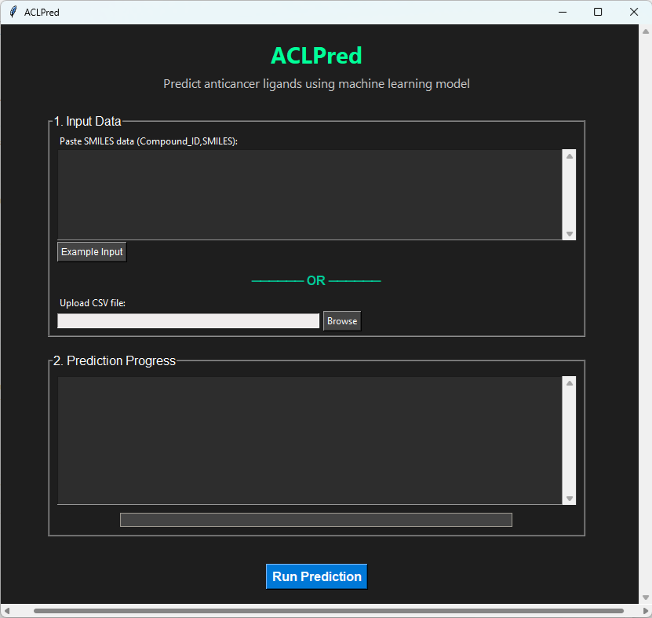

# ACLPred: Anticancer ligand prediction using machine learning model
**ACLPred** is a GUI-based tool designed for the prediction of Anticancer compounds from a large pool of chemical compounds. This method uses Light Gradient Boosting Machine (LGBM), a tree-based ensemble algorithm, to make the predictions. ACLPred allows users to screen potential anticancer compounds with high efficiency and accuracy. The overview of the developed model is shown in following figure:  


The ACLPred used pre-trained machine learning model based on molecular properties of the chemical compounds. Various machine learning algorithms were explored during development, and high-performing LGBM model was ultimately implemented in ACLPred. We evaluated the model performance using independent test data, external validation datasets as well as existing method to confirm its effectiveness and generalizability to predict anticancer compounds. Additionally, model interpretation analysis was conducted to identified key features that significantly contribute to anticancer activity prediction. 

#Getting Started

## Prerequisites

Before using ACLPred, ensure the required software and modules are installed:

* OS support: Windows, Linux
* Python version: 3.9 or higher

### Dependencies
- sklearn
- pandas
- numpy
- rdkit-pypi
- padelpy

## How to use

1. Clone or Download this repository:
```sh
  git clone https://github.com/yourusername/ACLPred.git
  cd ACLPred
```
2. Install dependencies:
```sh
   $ pip3 install -r requirements.txt
```
3. Run the tool:
  - For Terminal:
    ```sh
      python aclpred_gui.py
    ```
  - For Jupytor notebook:
    
      Upload `aclpred_gui.ipynb` in your jupytor notebook and `Run`
    
## GUI



### Input Format

You can provide input in two ways:

1. Paste Input (Text Box):
   Format should be `Compound_ID,SMILES` (See example input)

2. Upload CSV File:
   Your file should have two columns: `Compound_ID` and `SMILES` (See example file `/dataset/example_file.csv`)

## Output

The predictions are saved in `Output_result.csv` in the working directory and include:

  - `Compound_ID`
  - `Prediction` (`Anticancer` / `Non-anticancer`)
  - `Prediction_Probability` (confidence score)


## Citation


If you use ACLPred in your resrach, please cite:


## Contact


For any query, please contact at [yadavarvind@cau.ac.kr], [junmokim@cau.ac.kr].
